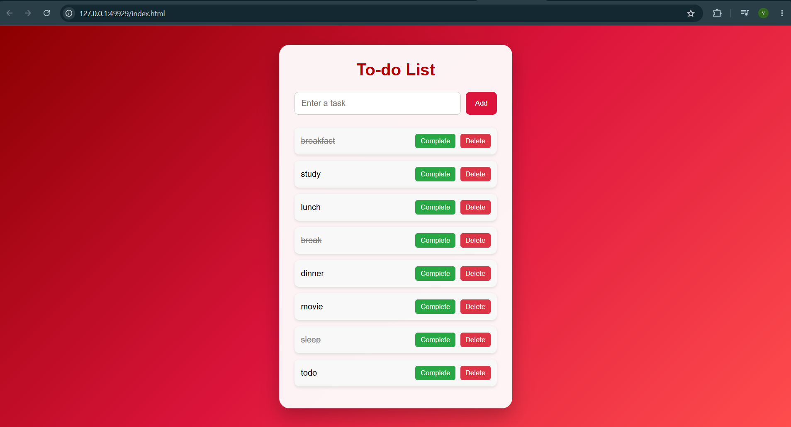
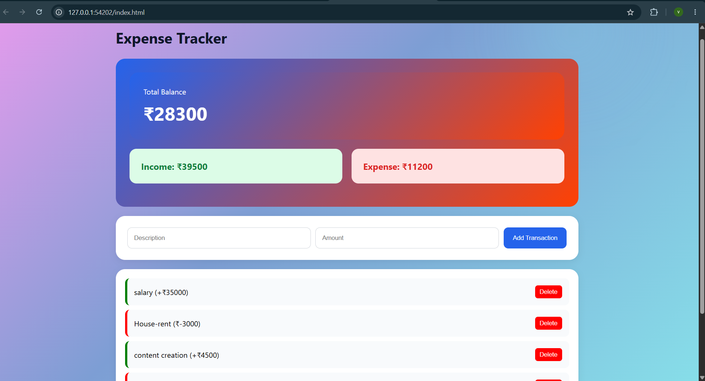

# web_journey
This repository documents my Web Development learning journey. It contains projects, practice exercises, and mini applications built while learning HTML, CSS, JavaScript, and modern web development concepts. Each project represents a step in improving my front-end and full-stack development skills.
## 1. Coffee Shop Landing Page ☕

A beginner-friendly web development project built using HTML and CSS. This project was created to practice the fundamentals of web design, including page structure, styling, layouts, and responsive design.

### Features

* Navigation Bar
* Hero Section
* About Us Section
* Menu Cards
* Contact Section
* Responsive Design
* Basic Hover Effects

### Technologies Used

* HTML5
* CSS3

## 2.To-Do List App

A simple and interactive To-Do List application built with HTML, CSS, and JavaScript.

### Features

* Add new tasks
* Mark tasks as completed
* Delete tasks
* Save tasks using Local Storage
* Responsive design
* Modern red-themed UI

### Technologies Used

* HTML5
* CSS3
* JavaScript (ES6)
* Local Storage API

### What I Learned

* DOM Manipulation
* Event Handling
* Arrays and Objects
* Local Storage
* Dynamic Rendering
* Responsive Design

## Project Preview

## 3.Quiz App

A simple and interactive Quiz Application built using HTML, CSS, and JavaScript.

### Features

* Multiple-choice questions
* Score tracking
* Instant answer feedback
* Question navigation
* Restart quiz functionality
* Responsive and modern UI

### Technologies Used

* HTML5
* CSS3
* JavaScript (ES6)

### What I Learned

* Arrays of Objects
* DOM Manipulation
* Event Handling
* Dynamic Content Rendering
* State Management

## 4.Expense Tracker

A modern Expense Tracker built with HTML, CSS, and JavaScript.

### Features
- Add Income & Expenses
- Real-time Balance Calculation
- Delete Transactions
- Local Storage Support
- Responsive Dashboard UI

### Technologies
- HTML5
- CSS3
- JavaScript (ES6)
- Local Storage API

### Concepts Learned
- DOM Manipulation
- Arrays & Objects
- forEach()
- filter()
- reduce()
- localStorage
  

